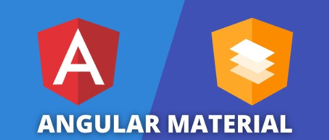

# Modal con Angular Material



## Uso de MatDialog

Los pasos a seguir serán los siguientes:

1. Instalar Angular Material
   Si aún no lo tenemos, deberemos instalar Angular Material en nuestro proyecto

    ```bash
    ng add @angular/material
    ```
  
    Durante la instalación, nos preguntará sobre un tema, tipografía y si queremos incluir animaciones. Eligimos las opciones que prefiramos.

   
###💡 Idea:
    Texto de la idea


3. Creamos el componente que utilizaremos como ventana modal.

    ```bash
    ng g c modal
    ```

4. Importar el módulo MatDialogModule en el fichero modal.ts

    ```typescript
    import { Component, Inject } from "@angular/core";
    import { MatDialogModule, MAT_DIALOG_DATA, MatDialogRef } from "@angular/material/dialog"; 
    import { MatButtonModule } from '@angular/material/button';
    ```
    Importamos también el MatButtonModule para utilizar botones de Angular Material

5.  Cofigurar el decorador @component con MatDialogModule

    ```typescript
    @Component({
    selector: 'app-modal',
    imports: [MatDialogModule, MatButtonModule],
    templateUrl: './modal.component.html',
    styleUrl: './modal.component.css'
    })
    ```
6.  Inyectar el servicio en el componente

    ```typescript
    constructor(
        public dialogRef: MatDialogRef<ModalComponent>,
        @Inject(MAT_DIALOG_DATA) public data: { mensaje: string }
    ) { }
    ```

    - MatDialogRef: Es una referencia al modal que se ha abierto. Lo utilizaremos para cerrar el modal (dialogRef.close()) y, opcionalmente, pasar datos de vuelta al componente que lo abrió.
    - MAT_DIALOG_DATA: Este token de inyección se utiliza para recibir datos que el componente que abre el modal le pasa.

7. Configurar un método para cerra el modal

    Utilizamos la referencia this.dialogRef creada en el constructor para poder cerrarlo mediante el método close().
      ```typescript
      modalCerrar(): void {
        this.dialogRef.close();
      }
      ```

    Si quisieramos pasar datos al componente que llama al modal deberiamos de pasarlos como parametro dentro del método close

    ```typescript
    modalCerrarDatos(): void {
      let dato = 'Valencia'
      this.dialogRef.close(dato);
    }
    ```
8. Crear el contenido del modal

    ```html
    <div mat-dialog-title style="display:flex; justify-content:space-between; align-items:center;">
        Titulo del Modal
    </div>
    <div mat-dialog-content>
      <p>{{ data.mensaje }}</p>
    </div>
    <div mat-dialog-actions>
      <button mat-button (click)="modalCerrar()">Cerrar</button>
      <button mat-button (click)="modalCerrarDatos()">Cerrar con Datos</button>
    </div>
    ```
    En el componente utilizamos directivas de Angular Material para estructurar y dar estilos predefinidos al modal.
    - mat-dialog-title
    - mat-dialog-content
    - mat-dialog-actions

    En el contenido del dialog interpolamos el dato recibido desde el componente que llama al modal con data.mensaje

9. Abrir el modal desde otro componente en nuestro caso desde AppComponent

    En AppComponent importamos el servicio MatDialog y el componente Modal que hemos creado

    ```typescript
    import { MatDialog } from '@angular/material/dialog';
    import { ModalComponent } from './modal/modal.component'
    ```
    Definimos una variable de tipo string o null para almacenar el dato que recibamos del modal cuando se cierre.

    ```typescript
    datoRecibido!: string | null;
    ```
    Inyectamos el servicio MatDialog en el constructor
    ```typescript
    constructor(public dialog: MatDialog) { }
    ```
    Definimos un método para poder abrir el modal y nos suscribimos para recibir el resultado cuando el modal se cierra
    ```typescript
      abrirDialogo(): void {
        const dialogRef = this.dialog.open(ModalComponent, {
          width: '300px', 
          height: '300px',
          data: { mensaje: '¡Este es un mensaje desde un diálogo Standalone!' }
        });

        dialogRef.afterClosed().subscribe(result => {
          if (result) {
            this.datoRecibido = result;
            console.log('Dato recibido del diálogo:', this.datoRecibido);
          } else {
            console.log('El diálogo se cerró sin pasar datos o con datos nulos.');
          }
        });
      }
    ```

10. Definimos en el HTML del AppComponent un boton para poder abrir el modal
    ```html
    <button mat-raised-button color="primary" (click)="abrirDialogo()">Abrir</button>
    ````
    
